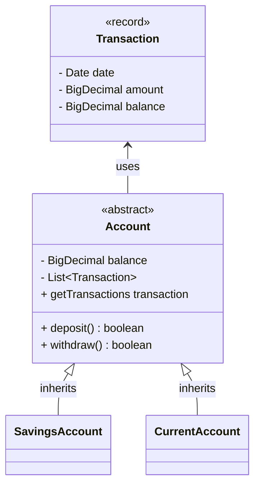

# Domain Model

``` java
1. 
As a customer,
So I can safely store and use my money,
I want to create a current account.

class CurrentAccount()
```

``` java
2.
As a customer,
So I can save for a rainy day,
I want to create a savings account.

class SavingsAccount()
abstract class Account()
```

``` java
3.
As a customer,
So I can keep a record of my finances,
I want to generate bank statements with transaction dates, amounts, and balance at the time of transaction.

record Transaction()
    Date date
    BigDecimal amount
    BigDecimal balance

abstract class Account()
    List<Transaction> transactions
    getTransactions()
```

``` java
4.
As a customer,
So I can use my account,
I want to deposit and withdraw funds.

abstract class Account()
    BigDecimal balance
    Transaction deposit()
    Transaction withdraw()
```


# Class Diagram

