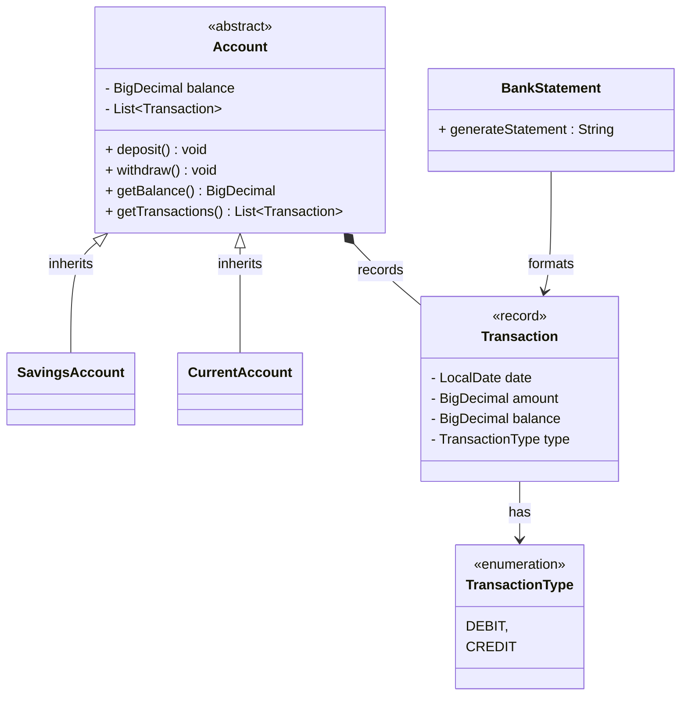

# Domain Model

``` java
1. 
As a customer,
So I can safely store and use my money,
I want to create a current account.

class CurrentAccount()
    BigDecimal balance
    getBalance() : BigDecimal 

```

``` java
2.
As a customer,
So I can save for a rainy day,
I want to create a savings account.

abstract class Account()
    BigDecimal balance

class SavingsAccount() extends Account
class CurrentAccount() extends Account

```

``` java
3.
As a customer,
So I can keep a record of my finances,
I want to generate bank statements with transaction dates, amounts, and balance at the time of transaction.

record Transaction()
    Date date
    BigDecimal amount
    BigDecimal balance
    TransactionType type

enum TransactionType
    CREDIT
    DEBIT

class BankStatement()
    generateStatement(transactions) : String

abstract class Account()
    List<Transaction> transactions
    getTransactions() : List<Transaction>

```

``` java
4.
As a customer,
So I can use my account,
I want to deposit and withdraw funds.

abstract class Account()
    deposit() : void
    withdraw() : void
```


# Class Diagram

