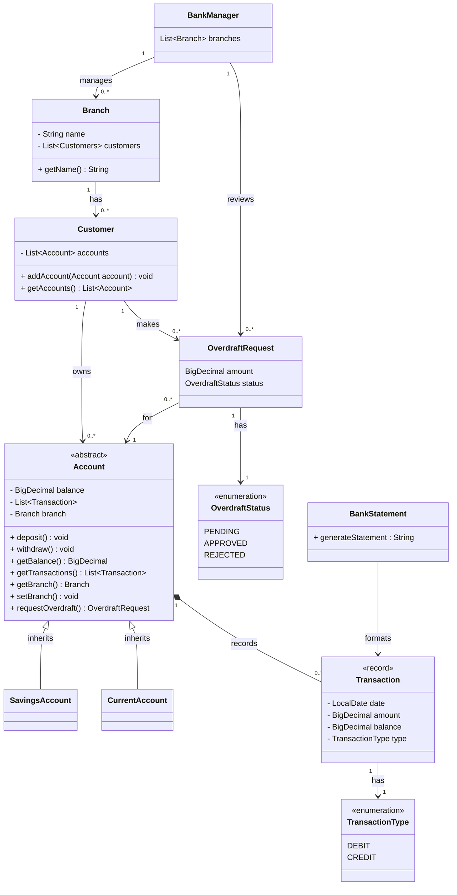

# Domain Model

```
1. 
As a customer,
So I can safely store and use my money,
I want to create a current account.
```
``` java
class CurrentAccount()
    BigDecimal balance
    getBalance() : BigDecimal 
```

```
2.
As a customer,
So I can save for a rainy day,
I want to create a savings account.
```
``` java
abstract class Account()
    BigDecimal balance

class SavingsAccount() extends Account
class CurrentAccount() extends Account
```

```
3.
As a customer,
So I can keep a record of my finances,
I want to generate bank statements with transaction dates, amounts, and balance at the time of transaction.
```
``` java
record Transaction()
    Date date
    BigDecimal amount
    BigDecimal balance
    TransactionType type

enum TransactionType
    CREDIT
    DEBIT

class BankStatement()
    generateStatement(transactions) : String

abstract class Account()
    List<Transaction> transactions
    getTransactions() : List<Transaction>
```

```
4.
As a customer,
So I can use my account,
I want to deposit and withdraw funds.
```
``` java
abstract class Account()
    deposit() : void
    withdraw() : void
```

## Extensions
### Extension 1: Stateless
```
5. 
As an engineer,
So I don''t need to keep track of state,
I want account balances to be calculated based on transaction history instead of stored in memory.
```

``` java 
remove BigDecimal balance from class Account and record Transaction

change getBalance() to calculate based on transactions
```

### Extension 2: Branches
``` 
6. 
As a bank manager,
So I can expand,
I want accounts to be associated with specific branches.
```

```java
class Branch 
    String name
    List<Account> accounts

abstract class Account
    Branch branch;

Does every Account need to have a Branch? Assuming no; it does not have a Branch until it has been added to that Branch's internal Account list.
```

### Extension 3: Overdrafts
```java
7. 
As a customer,
So I have an emergency fund,
I want to be able to request an overdraft on my account.
```
 
```java
8.
As a bank manager,
So I can safeguard our funds,
I want to approve or reject overdraft requests.
```

```java
Need to introduce Customers and BankManagers to manage this... or do we? Unsure if it''s overengineering ;__;

class BankManager
    List<Branch> branches

class Branch
    List<Customer> customers

class Customer
    List<Account> accounts
    
class OverdraftRequest
    BigDecimal amount
    OverdraftStatus status

enum OverdraftStatus
    PENDING
    APPROVED
    REJECTED
```


# Class Diagram

